## Introduction

### Hauppauge Capture Application

Hauppauge Capture Application combines Capture, Editing, and Streaming all into one easy-to-use interface. This document will cover the basic operation of the individual screens within the application.

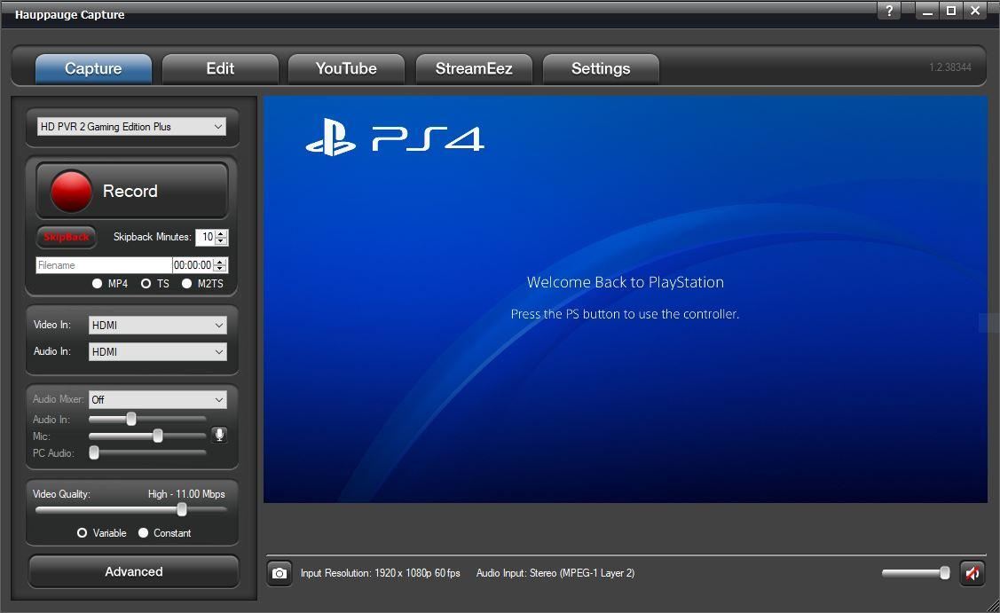

Please note that the menus and options available will change depending on the product that is connected. 

## Capture Tab

#### PVR Products

The following options are for Personal Video Recorder products such as the HD PVR, HD PVR 2, HD PVR Rocket, HD PVR Pro 60, Colossus, and Colossus 2. 

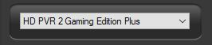

**Device Dropdown:** These settings will list Hauppauge capture devices on your system if you have multiple devices. At the moment the following devices are supported by Hauppauge Capture. HD PVR, HD PVR 2, HD PVR Rocket, HD PVR Pro 60, Colossus, Colossus 2. As well these analog devices Impact VCB-e, and USB-Live2.

**Record**: Click it to start recording. Click it to stop when recording or use the push button on the top of the HD PVR 2, HD PVR Rocket, or HD PVR Pro 60 to start and stop recordings.

**SkipBack**: If enabled, the Hauppauge Capture application will begin recording as soon as the application is opened. SkipBack sets the amount of buffer recording time the application will store. For example, if the application has been opened for 20 minutes and the Skipback is set to 10 minutes when you press the Record button your recording will include the previous 10 minutes before you pressed the Record button.

**Filename**: You can type your filename or leave the default filename layout which is HDPVR2_Yr/Mo/Day_Hr/Min. A timer is available on the right to record for a specified amount of time. For example, if you select 10:00. It will countdown for 10 minutes and stop recording.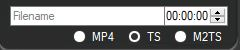

**File Type**: Three options are available for recording. They are Transport Stream or TS is our default capture format. MPEG-2 Transport Stream or .m2ts is a Blu-ray format. MPEG-4 Part 14 or .mp4 is best for online sharing. 

_Note: Analog products do not have the .mp4 file option. Also, our original HD PVR is not supported._

**Video Input**: Click the dropdown to choose your video input (HDMI, Component, S-Video, or Composite).

**Audio Input**: Click the dropdown to choose your audio Input (AV IN, SPDIF (Optical), HDMI, or LineIn PC).

**Audio Mixer**: Click the dropdown to turn ON the audio mixer with or without a microphone. If a microphone is connected, it will show up on the dropdown menu. There are separate volume controls for Audio In, Mic, and PC Audio so you can find the correct audio balance.

**Video Quality**: You can adjust the bitrate of your recordings. The higher the bitrate the better the video quality but also makes the file size larger. You can also select if you would like to capture in variable bitrate or constant bitrate. 

_Note: The HD PVR Pro 60 and HD PVR Rocket can only capture in variable bitrate._ 

**Advanced**: Click to open the Advanced menu. 

**Camera button**: Use this to snap still frame images. Files by default are stored at C:\Users\Public\Public Videos\

**Input resolution**: This indicates the input resolution that Hauppauge Capture is detecting from the source (game console, set-top box, PC, etc.).

**Audio Input**: This indicates the audio input that Hauppauge Capture is detecting from the source. 

**Volume Control**: Slide bar and **Mute** button are on the lower right.

#### Analog Products

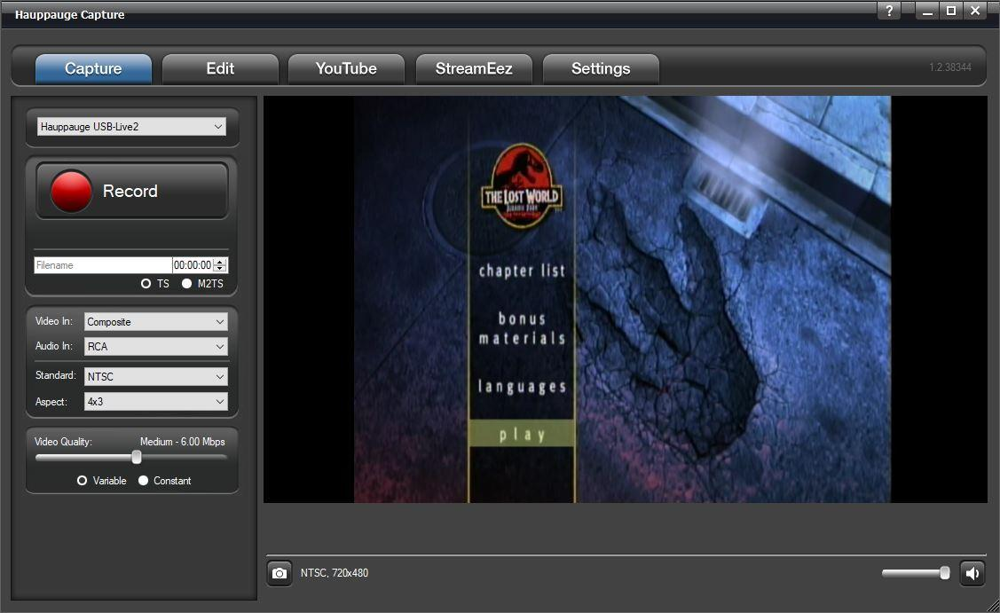

**Device Dropdown:** These settings will list Hauppauge Capture devices on your system if you have multiple devices. At the moment the following devices are supported by Hauppauge Capture for analog. The Impact VCB-e and USB-Live2.

**Record**: Click it to start recording and click it to stop when recording.

**Filename**: You can type your filename or leave the default filename layout which is Analog_Yr/Mo/Day_Hr/Min. A timer is available on the right to record for a specified amount of time. For example, if you select 10:00. It will countdown for 10 minutes and stop recording. 

**File type**: Only TS and M2TS formats are available. They are Transport Stream or TS is our default capture format. MPEG-2 Transport Stream or M2TS is a Blu-ray format.

**Video In**: Click the dropdown to choose your video input (Composite or S-Video).

**Audio In**: Audio can only be RCA. 

**Standard**:** **Click the dropdown to choose your video standard (NTSC, PAL, NTSC-J, or SECAM). The software will make the change after a few seconds. No need to close and reopen Hauppauge Capture. 

**Aspect**:** **Click the dropdown menu to capture in 4:3 or 16:9 ratio. The software will make the change after a few seconds. No need to close and reopen Hauppauge Capture.

**Video Quality**:** **You can adjust the bitrate of your recordings. The higher the bitrate the better the video quality but also makes the file size larger. You can also select if you would like to capture in variable bitrate or constant bit rate. 

### Advanced Settings

#### Video Scaler

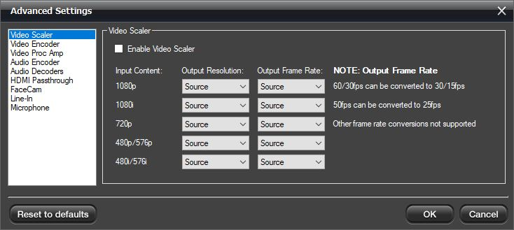

**Enable Video Scaler**: Check this option if you wish to downscale your video.

_Note: All settings are for downscaling, there is no upscaling._

**Output Resolution**: This section allows you to downscale the source resolution to a lower resolution.

_Note: only certain resolutions can be used based on the source resolution. Selecting "Source" indicates no scaling._ 

**Output Frame Rate**: This section allows you to downscale the frame rate. For example, you can downscale 60fps to 30fps. Selecting "Source" indicates no scaling.

#### Video Encoder

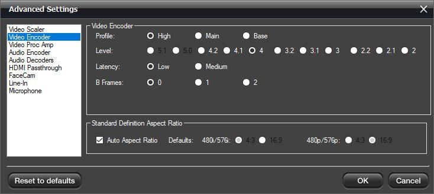

**Video Encoder**: It sets the H.264 specification defined "Profile" and "Level" parameters. The default settings are our recommended values. For exact details please consult the H.264 specification online.

**Standard Definition Aspect Ratio**: Auto will be default for the standard definition aspect ratio. If you would like to override it, you uncheck the box and select 16:9. 

#### Video Proc Amp

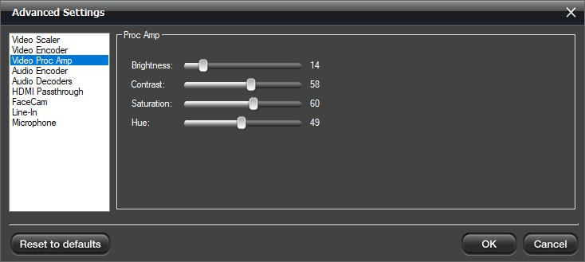

**Video Proc Amp**: These controls adjust recording and pass-thru picture quality.

_Note: Not all of these controls have an effect and are model specific._ 

#### Audio Encoder

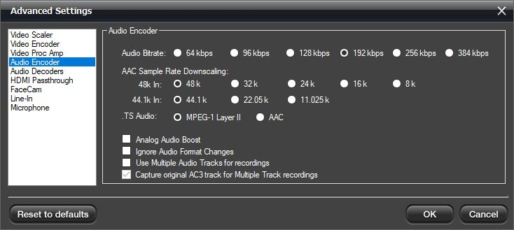

These settings affect the audio capture.

**AAC Bitrate**: This lets you change the AAC encoding bitrate. The default is 192kbps.

**AAC Sample Rate Downscaling**: The sample rate is based on the source audio.

The source is either 48k or 44.1k, but you can't tell what is coming in. All you can do is downscale to the choice you want.

**.TS Audio**: In two-channel audio or when recording with voice audio, you can change how audio is encoded 

**Analog Boost**: Increases the audio level for left and right analog audio sources.

**Ignore Audio Format Changes**: When unchecked, if the audio changes from 2ch to 5.1 or vice versa, the video preview will reset. When checked it will ignore the change and stay in the current mode. 

**Use Multiple Audio Tracks for recordings**: This will split the recorded audio into separate tracks. Mic audio on its track, PC audio on its track, etc. In case you would like to edit them separately. 

**Capture original AC3 track for Multiple Track recordings**: In multi-track audio, it keeps the original 5.1 stream rather than downmixing from 5.1 via audio mixer to 2ch.

#### Audio Decoders

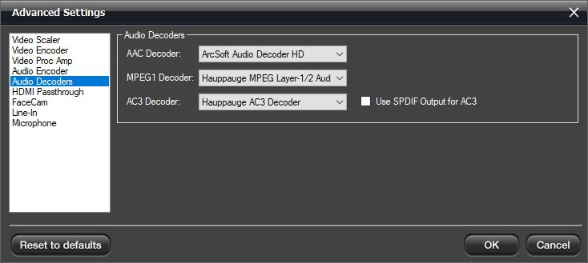

Audio Decoders are used for playback of audio in Hauppauge Capture. They do not change how audio is captured. Audio decoders are provided but can be changed with third-party decoders if you wish. 

#### HDMI Passthrough

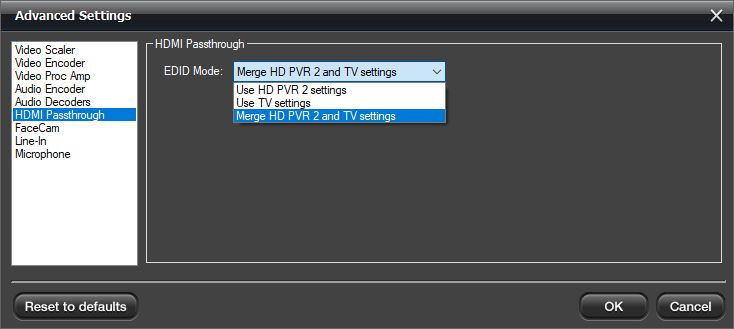

**EDID Mode**: (Extended Display Identification Data) is a small configuration file stored on devices that contains information about the type of signal the device can accept, such as resolution, frame rate, audio, and much more. This information is transmitted from our capture device to the monitor it is connected to. 

**Merge HD PVR 2 and TV Settings**: This is the default mode. It combines our capture device capabilities and TV information for the best functionality. 

**Use HD PVR 2 Settings**: This will force the use of the capabilities of our devices to be passed on to the TV. 

**Use TV Settings**: This will force the HD PVR 2 to accept what the TV is capable of receiving. 

#### Facecam

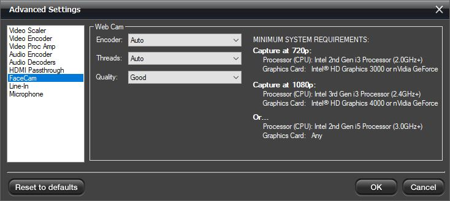

**Encoder**: Auto uses the h.264 encoder chip on the device, while Software Encoder uses your CPU to encode the video. 

**Threads**: Uses your CPU threads to help process the webcam video. Auto is the default. 

**Quality**: The default is Good quality, but you can reduce it to Low or increase it to Best. 

#### Line-In

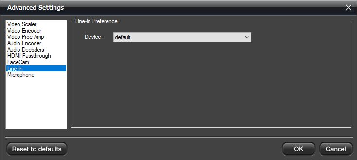

**Device**: This allows you to record from the Line-In of your PC as the audio source.

#### Microphone

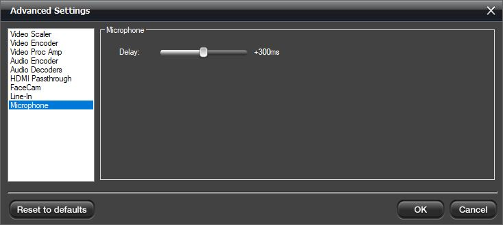

**Microphone**: Adjusts delay of microphone audio to game audio in milliseconds.

## Edit Tab

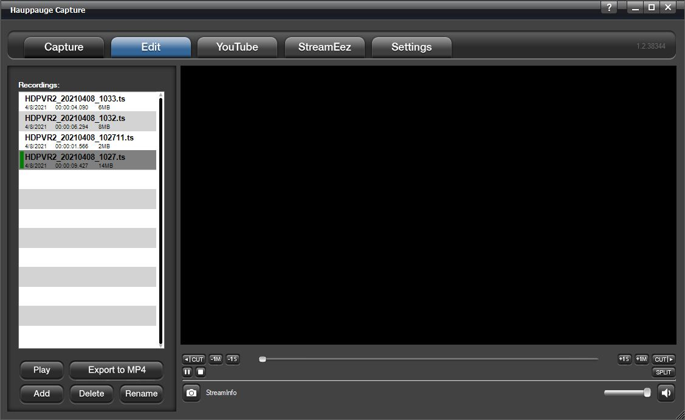

**Recordings**: The recorded files will be listed here. Click the recording with which you wish to work with.

**Play**: Click to play your file. You can  stop or 
 pause  play your file with the buttons located below the  cut left button below the playback window on the left.

**Export to MP4**: Files captured in TS or M2TS can be exported to MP4 after already being captured.

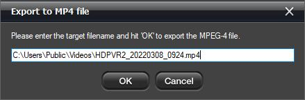

_Note: files can only be exported to MP4, but you can’t edit MP4 files. Only .TS and .M2TS files can be edited by Hauppauge Capture_.

**Add**: Use to import a file into the editor file list.

**Delete**: Click to delete a recording or edited file. A file deleted through the application will be completely deleted and will not go to the recycling bin. 

**Rename**: Click to rename a file. If a file is currently open, you must hit stop first before renaming the file. 

### Using the cuts editor

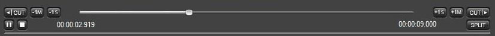

You can navigate through your clip using the slider or just watch your video to find your cut points. You can also use the back button  and forward button 
 to move in 1-minute increments. Use the  and  for one-second increments.

If you wish to cut off the first minute of the clip navigate there and click the  this will remove the first minute and recreates the file. The same thing applies if you wish to remove something from the back end. Find the spot and click the 
 button. The  button will let you split the file and will create two files at the point you choose.

This is a simple cuts editor. If you need to put the pieces together to create a new file you will need to copy the clips you wish to work with into a third-party video editor.

## YouTube Tab

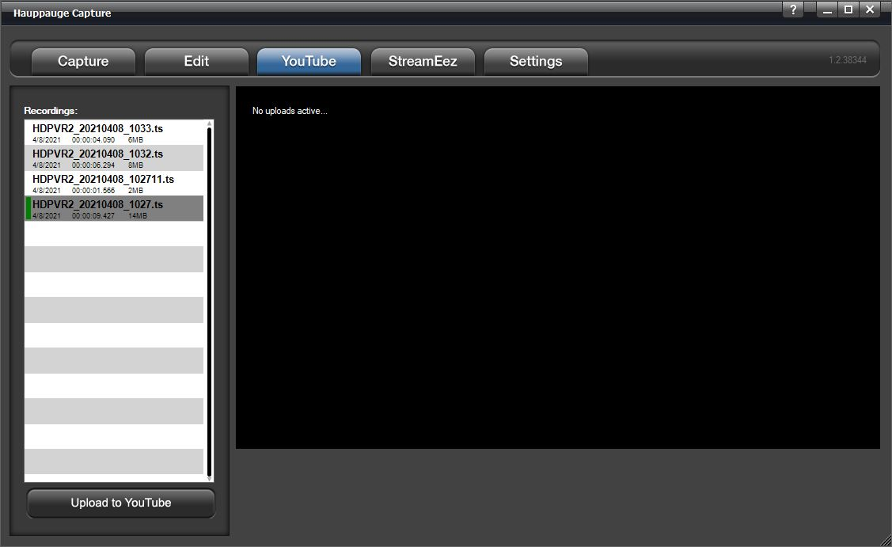

Hauppauge Capture can upload your recorded videos directly to YouTube within the application. All video files are uploaded in the resolution that they were captured in.

**Recordings**: Any recordings available for uploading will be listed here. Highlight the recording you want to upload.

### Upload to YouTube

Press the **Upload to YouTube** button and you will need to login to your Youtube account to authorize Hauppauge Capture to upload files for you. 

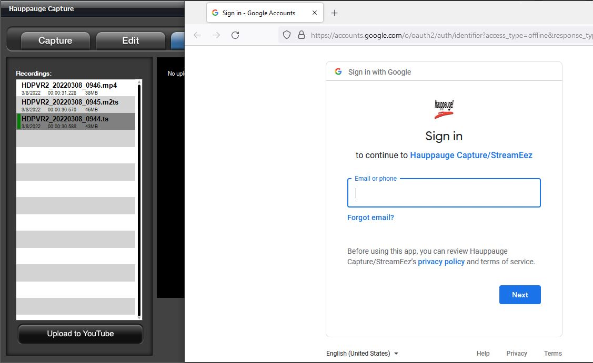

Once authorized you will see the Share Recording dialog box.  

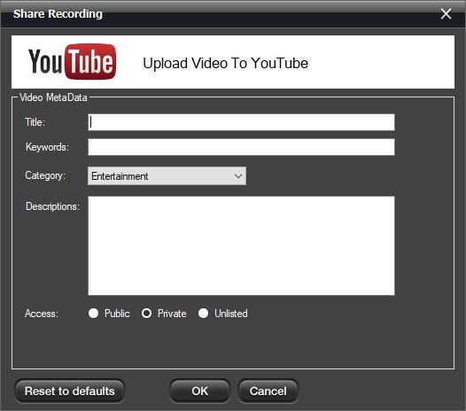

_Note: All fields are required for uploading._

### Video Metadata

YouTube is the world's second-largest search engine, and it uses metadata - your video's title, tags, and description - to index your video correctly. To maximize your presence in search, promotion, suggested videos, and ad-serving, make sure your metadata is well optimized.

**Title**: type in a title for your video.

**Keywords**: type in at least one keyword. This is essentially tags.

**Category**: Select a category for your video.

**Descriptions**: type a description for your video.

**Access**: select public and everyone can see it or private and only you can see it while logged into your YouTube account. Unlisted and only can be viewed with direct access to the link. 

Click **OK** to upload the video. If the connection is successful you will see the upload progress bar.

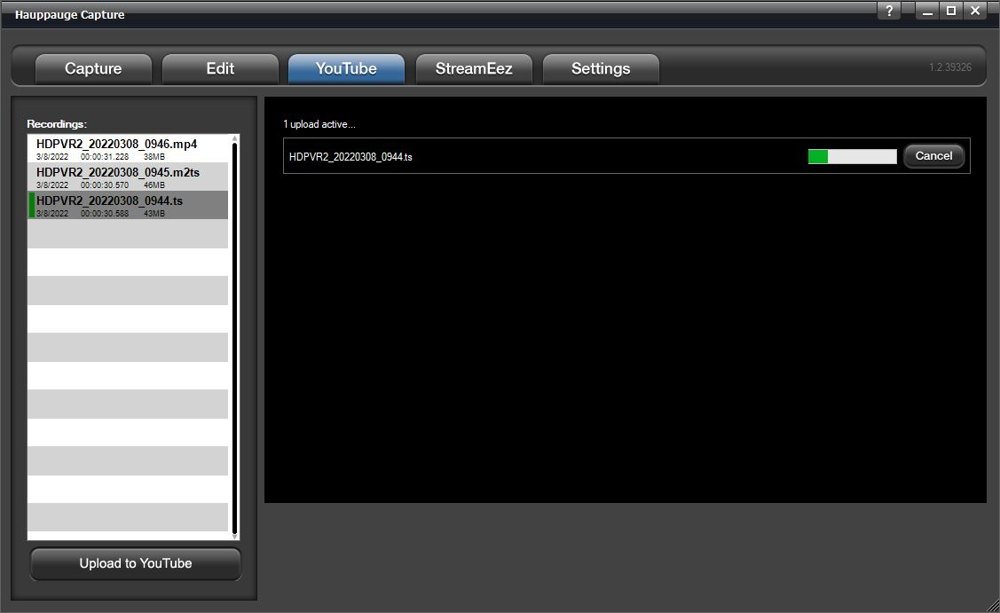

## StreamEez

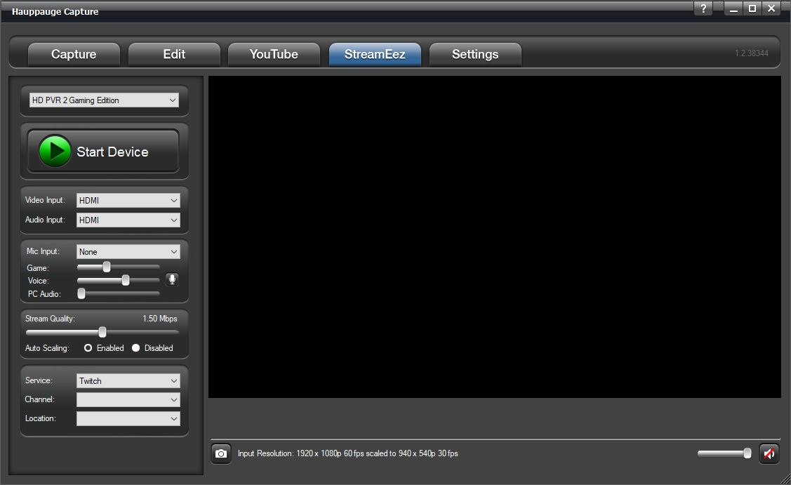

StreamEez will let you Stream your video with Facebook, Twitch, and YouTube.

### Using StreamEez

_Note: you must have a valid account with Facebook, Twitch, or YouTube_.

Select the Video and Audio Inputs that you are using and then click **Start Device**.

Adjust the **Microphone Input** settings if needed.

**Stream Quality**: Select the upload bit rate you want to stream at from 0.50 Mbps to 6.00 Mbps.

**Auto Scaling:** If enabled (default) it adjusts the streaming resolution based on the stream quality. Example 1080p resolution streamed at 0.50 Mbps can't handle 1080p, auto-scaling will change the resolution to 640x360. If you increase stream quality to 2.00 Mbps it will adjust it to 1280x720. If disabled it will attempt to stream at incoming resolution. Also, Advance Streaming will become available.

**Service**: Select the streaming service, either Facebook, Twitch, or YouTube.

**Channel**: Select the service Facebook, Twitch, or Youtube.

If you select **Twitch **you will get the following login screen. 

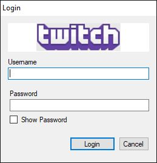

**Location**: Once logged in, it will show you the nearest server that you can connect to for Twitch only.

If you select **Facebook**, you will need to provide the Server URL and Stream Key. 

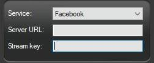

You can get this information by login into your Facebook accounts and going to the following link. [https://www.facebook.com/live/producer](https://www.facebook.com/live/producer) 

**YouTube **will open your default browser and ask you to log in to your Google account.

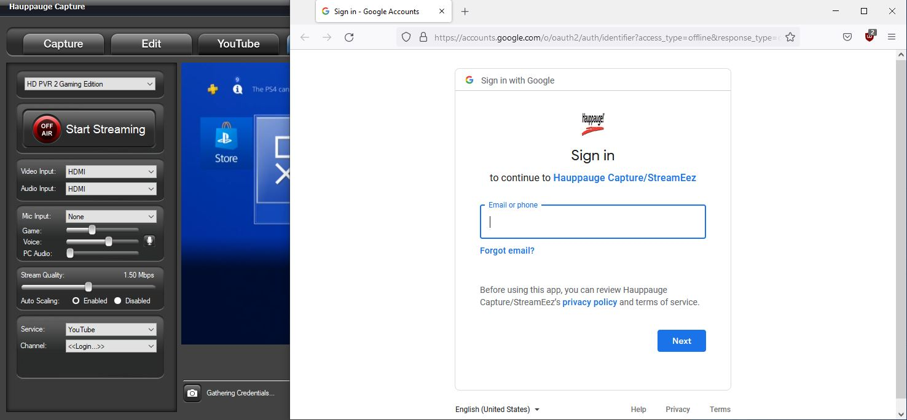

Once you set all your options. You can now press the **Start Streaming** button.

A link will be provided at the bottom of the software to access your stream or share it with others.

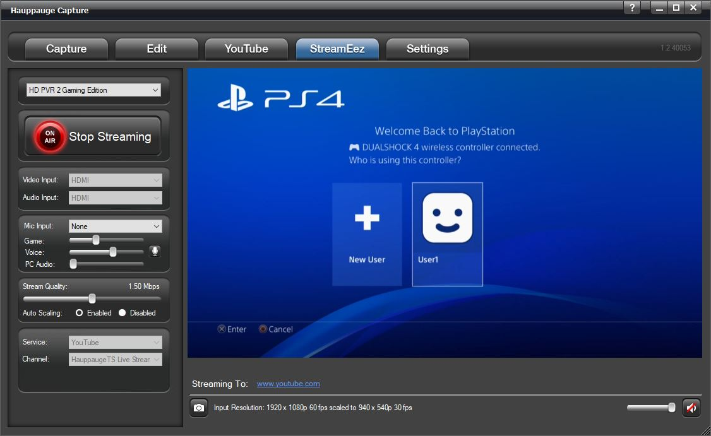

When you are done with streaming you can click on **Stop Streaming**.

### Advance Streaming Settings

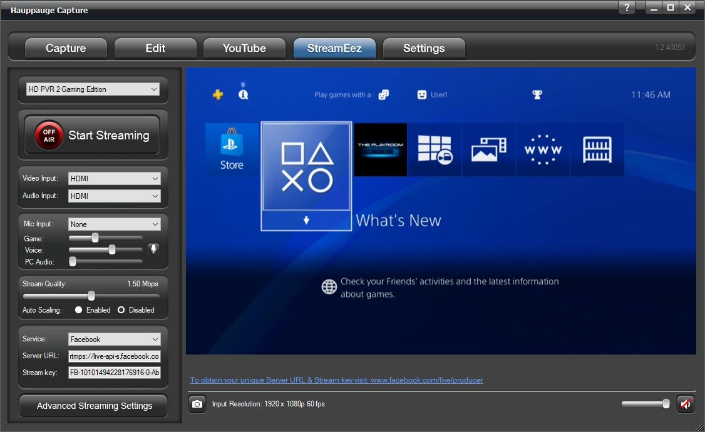

When you disable Auto Scaling you will have an Advance Streaming Settings menu available. The advanced streaming settings menu has options for Video Scaler, Audio Encoder, and Microphone. More information about these settings can be found on the Advanced Settings page.

## Settings Tab

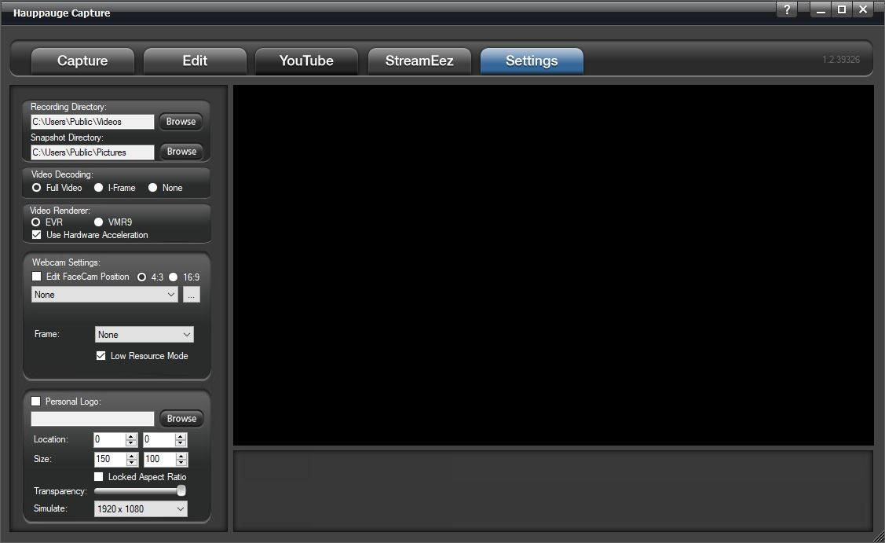

**Recordings Directory**: Default location listed. You can change the video directory here.

**Snapshot Directory**: Default location listed. You can change the snapshot directory here.

**Video Decoding**: 

**Full Video**: video preview will show all frames of the video.

**I-Frames only**: video preview will only show I-frames (every 2 seconds of video) use this setting to help smooth out the preview on slower systems or low-end graphics systems.

**None**: No preview at all. Video will still record and audio will be heard.

**Video Renderer**:

**EVR** or **VMR9**: Specifies the video renderer to be used. The video renderer is a software

interface to your display adapter. Changes take effect after restarting the application.

**Use Hardware Acceleration**: This will allow your graphics system to use hardware acceleration for video decoding. 

_Note: Graphics hardware acceleration does not work on all systems. It is a feature of your graphics chipset. Use this feature to help the preview video if it is not smooth._

### Webcam

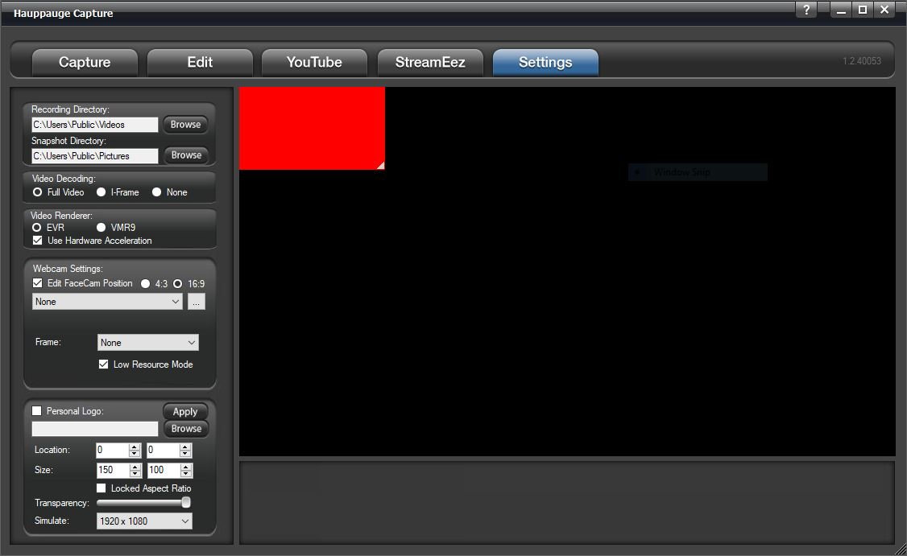

You can select from the dropdown menu your webcam to use for the FaceCam option. It would be placed above your video. 

**Edit FaceCam Position**: Check this box to be able to move the FaceCam widow on the screen. You can also select if you want the screen to be in **4:3 **or **16:9** ratio.  

**Frame**: The dropdown gives you multiple styles of frames to use around your Facecam Video. 

**Low Resource Mode**: Save CPU resource when FaceCam is ON. Sets Video Decoder to "I-Frame" so it only shows 1 frame every second and also reduces the encoded video quality to say 720p30 instead of source.

### Personal Logo

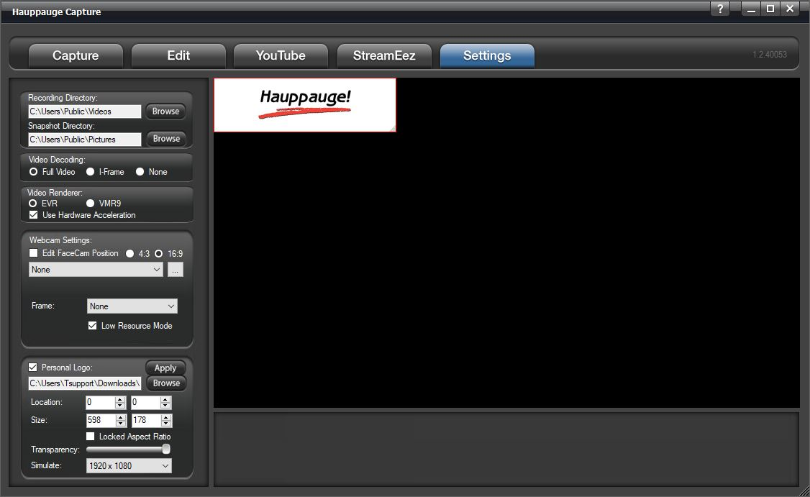

You can use the Personal Logo to add a personal logo or picture to your recordings.

**Personal Logo**: check the box to turn on/off the personal logo. 

Click the **browse** button and locate your file then select it and it will appear in the upper left of the video window.

**Location**: select the position for your logo on the screen. You can also move around with your mouse. 

**Size**: Select the size for the personal logo on the screen. You can also drag in and out with your mouse. 

**Transparency**: adjust the transparency of the image using the slider.

**Simulate**: drop-down and choose the resolution in which you will be recording. This will size the image to that resolution.

When finished click **Apply **and the settings will be stored.

## Hauppauge Device Central

Hauppauge Device Central is a tool installed with Hauppauge Capture. It allows you to modify what the button on top of the HD PVR 2, HD PVR Rocket, HD PVR Pro 60 will do. 

You can open Hauppauge Device Central by clicking on the icon in the taskbar.

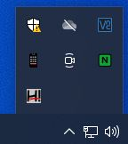

You can select in the Hauppauge Devices application that opens the behavior of the button on the device. By default, it should open Hauppauge Capture and start recording. 

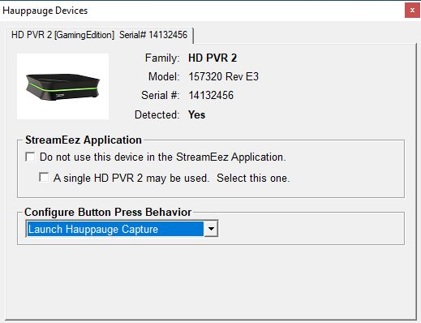

If the Hauppauge Device Central icon is not on your taskbar, you can manually reopen it by navigating to the following shortcut. 

C:\Program Files (x86)\Hauppauge\DeviceCentral\HcwDCTrayTool.exe
